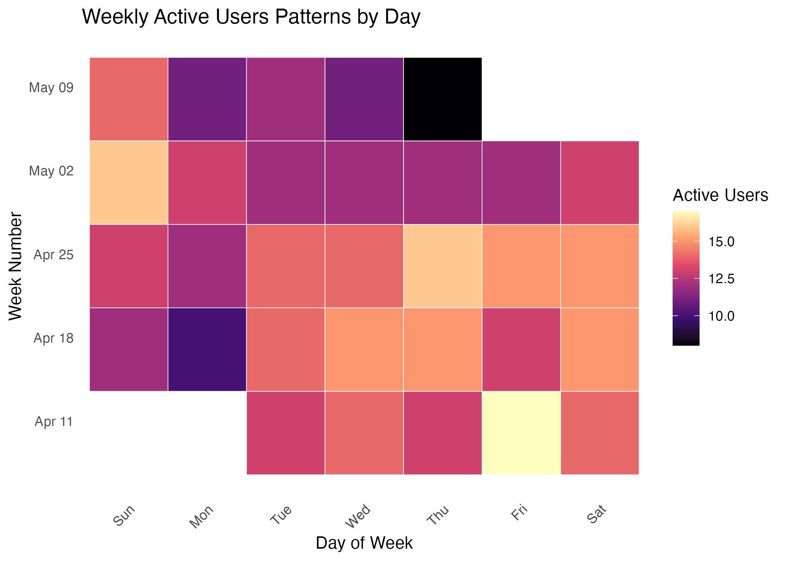
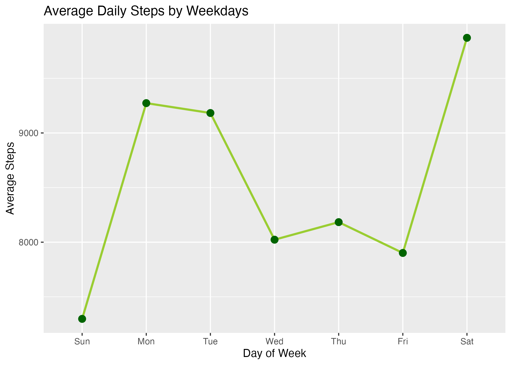
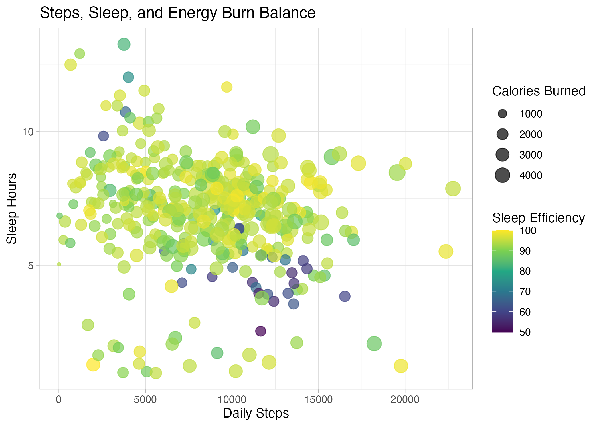
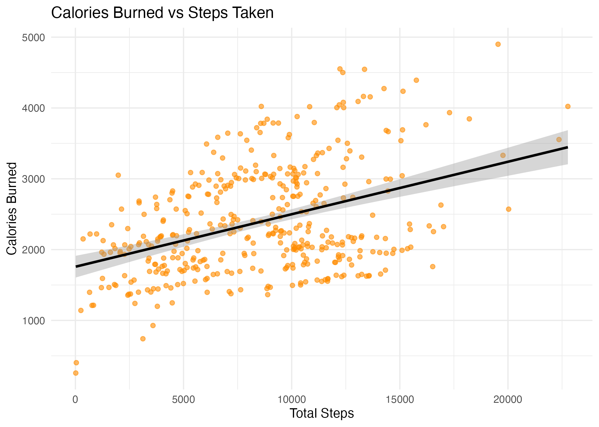
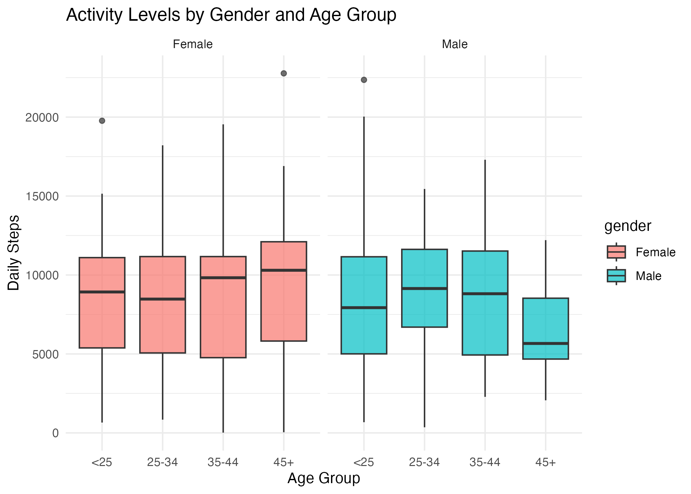
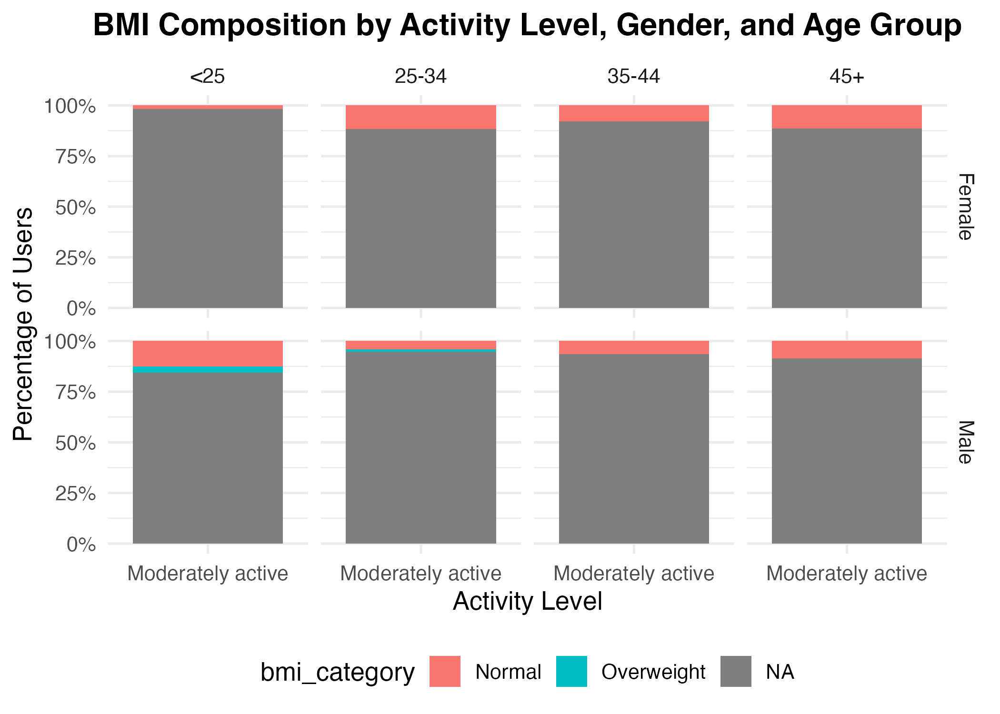
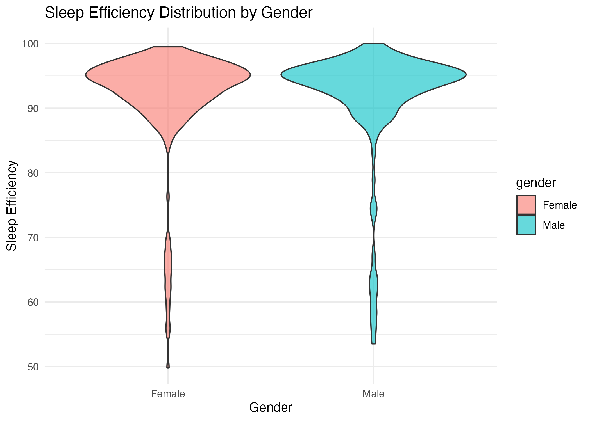
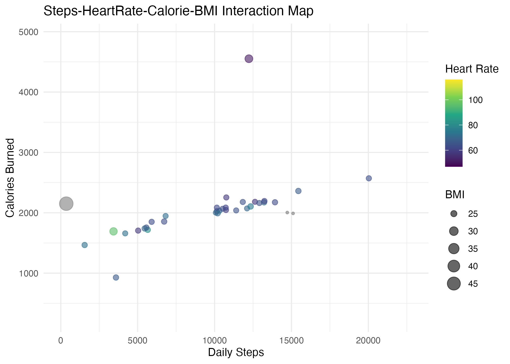
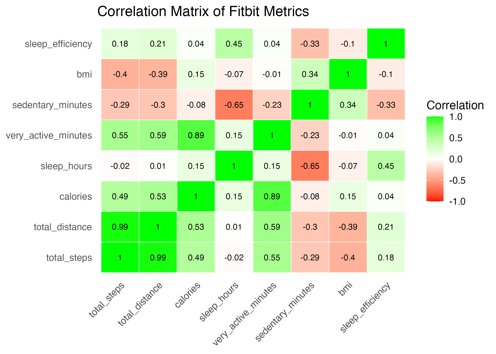

# Bellabeat-Device-Consumer-Behaviour-Analysis
#### Author: Christopher Edozie Sunday
#### Tech Stack: R (tidyverse, ggplot2, dplyr) | R Markdown | GitHub Pages
#### Project Type: Data Analytics & Visualization
#### Stakeholders: Bellabeat Executive Team (CEO, CCO, Marketing Directors).
#### Keywords: Data cleaning, R Programming, data storytelling, Fitbit dataset, Bellabeat case study, data-driven insights
#### Status: Completed

### Project Overview
This project analyzes Fitbit smart device usage data to identitify wellness behaviour patterns among its users. The goal is to uncover trends that can guide Bellabeat’s marketing strategies and engagement models for its products (focusing on  Bellabeat Time Smartwatch). This project is part of the Google Data Analytics Capstone context, extended for open-source demonstration and portfolio building.

### Business Task
Identify key behavioral trends from Fitbit smart device data analysis to provide actionable insights that can guide Bellabeat’s marketing strategies, enhance user personalization, and support sustainable business growth.

### Objectives
- Identify **activity and engagement patterns** across users.  
- Explore **heart rate and BMI segmentation** to reveal health and fitness levels.  
- Discover **time-based and lifestyle trends** that can drive marketing campaigns.  
- Provide **data storytelling** insights that connect user habits to product positioning.

### Project Folder Structure                

    Bellabeat-Device-Consumer-Behaviour-Analysis/
    │
    ├── fitbit_raw_data/               # Raw Fitbit datasets
    │   ├── daily_activity.csv
    │   ├── sleep_day.csv
    │   ├── weight_log.csv
    │   └── heartrate_seconds.csv
    │
    ├── scripts/                       # R scripts for data cleaning, analysis, & visualization
    │   ├── 01_data_cleaning.R
    │   ├── 02_exploratory_analysis.R
    │   └── 03_visualization_plots.R
    │
    ├── reports/                       # Project reports
    │   ├── Bellabeat_Device_Consumer_Behaviour_Analysis_Report.Rmd
    │   └── Bellabeat_Device_Consumer_Behaviour_Analysis_Report.html
    │
    ├── figures/                       # Exported plots
    │   ├── Weekly_Active_Users_Patterns_by_Day.png
    │   ├── Calories_Burned_vs_Steps_Taken.png
    │   └── Activity_Levels_by_Gender_and_Age_Group.png
    │   └── Other_Visualizations.png 
    │
    ├── Cleaned_merged_fitbit_data.csv  # Cleaned & merged fitbit dataset used for the analysis
    │
    └── README.md                       # Project overview & documentation   
                                                                     
### Key Analyses
- User Activity Trends: Daily and weekly activity frequency
- Sleep Patterns: Sleep duration and efficiency correlations
- Calories & Steps: Activity intensity vs. energy expenditure
- Heart Rate Metrics: Resting vs. active heart rate trends
- Demographics: Probabilistic age and gender distributions

### Data Features Used
    | Variable          | Description                                                          |
    |-------------------|----------------------------------------------------------------------|
    | `date`            | Daily tracking date                                                  |
    | `daily_avg_steps` | User’s average daily step count                                      |
    | `calories`        | Daily calories burned                                                |
    | `sleep_hours`     | Sleep duration per day                                               |
    | `heartrate`       | Heart rate (bpm)                                                     |
    | `activity_level`  | Categorized into “Highly Active”, “Moderately Active”, or “Sedentary”|
    | `bmi_category`    | Classified as “Underweight”, “Normal”, “Overweight”, or “Obese”      |
    | `heart_rate_level`| Labeled as “Resting”, “Normal”, “Fat Burn”, or “Cardio”              |

### Key Visualizations
### 1️. Weekly Active Users Patterns by Day

Insight: Activity fluctuates weekly, it peaks mostly on weekends — campaigns should target low-activity periods (midweek when activity dips) with motivational prompts.

### 2. Average Daily Steps by Weekdays

Insight: Users show fluctuations in activity patterns over weekdays, often peaking on weekends — campaigns should Promote Bellabeat Time features (e.g., step reminders) during low-activity periods to re-engage users

### 3. Steps, Sleep, and Energy Burn Balance

Insight: User clusters reveal 'distinct personas' — target high performers with performance analytics, and low performers with habit-building programs.

### 4. Calories Burned vs Steps Taken

Insight: Reveals linear relationship between steps taken and calories burned, physical activity directly translates to calorie expenditure — promote Bellabeat’s data accuracy in tracking fitness goals and encourage users to meet step targets.

### 5. Activity Levels by Gender and Age Group

Insight: Younger users generally walk more, while older groups show steadier habits — target younger users with “performance and tracking” campaigns,  older ones with “balance and wellness” messaging.

### 6. BMI Composition by Activity Level, Gender, and Age Group

Insight: Shows proportion of overweight users in sedentary groups — campaigns should promote heart-friendly activity challenges for overweight users.

### 7. Sleep Efficiency Distribution by Gender

Insight: Compares recovery quality across genders — a strong wellness differentiator — campaigns should frame Bellabeat Time as a personalized wellness and recovery assistant, focusing on holistic recovery and mindfulness.

### 8. Sleep Duration by Weekdays

Insight: Users generally have higher sleep hours during weekends — position Bellabeat Time as a sleep-aware assistant to help balance performance with rest.

### 9. Steps-HeartRate-Calorie-BMI Interaction Map

Insight: Shows distinct clusters of “performance-driven” vs. “wellness-oriented” users — campaigns should personalize smartwatch content for: (i) High intensity users - emphasizing more on performance tracking, and (ii) Low activity users - promoting habit formation and mindfulness 

### 10. Correlation Matrix of Fitbit Metrics

Insight: Reveal which Fitbit metrics are most strongly correlated, and the interdependencies of steps ↔ calories ↔ active minutes — campaigns should highlight the integrated nature of Bellabeat tracking — how improved activity affects sleep, calorie burn, and stress levels.

### Insights Summary
- Weekday patterns show higher activity during mid-week with reduced engagement on weekends.
- Sleep efficiency is positively correlated with consistent daily activity.
- Users with moderate daily step goals demonstrate better long-term engagement.
- Behavioural segmentation suggests opportunities for personalized recommendations via the Bellabeat app.

### Insight-driven Marketing Strategies
    | Theme                       | Marketing Opportunity                                                |
    |-----------------------------|----------------------------------------------------------------------|
    | Engagement Cycles           | Launch in-app activity challenges during low-activity months.        |
    | Moderately Active Users     | Offer step milestone rewards and personalized coaching notifications.|
    | Heart Rate Awareness        | Promote heart-health insights and cardio zone tracking.              |
    | Weight Management           | Use BMI trends to target campaigns focused on fitness goals.         |
    | Sleep & Recovery            | Emphasize wellness balance and stress recovery features.             |

### Next Step
- Deploy automated weekly insights dashboard using R Markdown or Tableau Public integration.

### Conclusion
This data-driven analysis has provided Bellabeat with a clear, evidence-backed marketing strategy for Time smartwatch. By understanding users’ lifestyle patterns and emotional motivators, Bellabeat can strengthen its market leadership in women’s wellness technology through empathetic, personalized, and data-guided engagement.

### Analytical Tools & Packages
- R Programming: Data cleaning, transformation, visualization, data wrangling, storytelling
- Packages: `tidyverse`, `ggplot2`, `scales`, `RColorBrewer`, `lubridate`, `dplyr`, `knitr`, `viridis`, `corrplot`, `reshape2`, `janitor`, `cluster`, `janitor`, `skimr`, `patchwork`, `factoextra`, `readr`, `flextable`, `ggridges` 
- RMarkdown: Reproducible reporting and HTML documentation
- Git & GitHub: Version control and project collaboration

### How to Run the Analysis or View the Full Report
#### 1. Prerequisite:
Install the necessary R packages listed in analytical tools and package section above:  
install.packages(c("tidyverse", "lubridate", "ggplot2", "....")

#### 2. Run the R Markdown File:
- Open the Bellabeat_Device_Consumer_Behaviour_Analysis_Report.Rmd file in in RStudio.
- Knit the .Rmd file to generate the HTML report.

#### 3. View the Final Report:
Open the following link in any browser to view the comprehensive analysis report which includes analysis and visualizations, key analytical findings and insights, quantified business value, data-driven marketing recommendations, implementation roadmap, lessons learned, conclusion:  
https://cedozie.github.io/Bellabeat-Device-Consumer-Behaviour-Analysis/Bellabeat_Device_Consumer_Behaviour_Analysis_Report.html

### Skills Demonstrated
- Data cleaning and transformation with dplyr
- Data visualization with ggplot2
- R Markdown report
- Interactive HTML report with visualizations and business insights
- Analytical storytelling for business decision support
- Version control and project publishing with Git/GitHub

### License
This project is licensed under the MIT License.

### Acknowledgments
Data source: Fitbit Fitness Tracker Data (Kaggle).
Inspiration: Bellabeat Case Study – Google Data Analytics Capstone Project.

### Author Details
- #### Christopher Edozie Sunday, Ph.D. 
- Data Analyst | Scientific Researcher 
- LinkedIn Profile: https://www.linkedin.com/in/c-sunday/
- GitHub Portfolio: https://github.com/cedozie
- Email: c.edozie.sunday@gmail.com
- Canada 

*Empowering data storytelling that drives smarter health tech marketing decisions*
